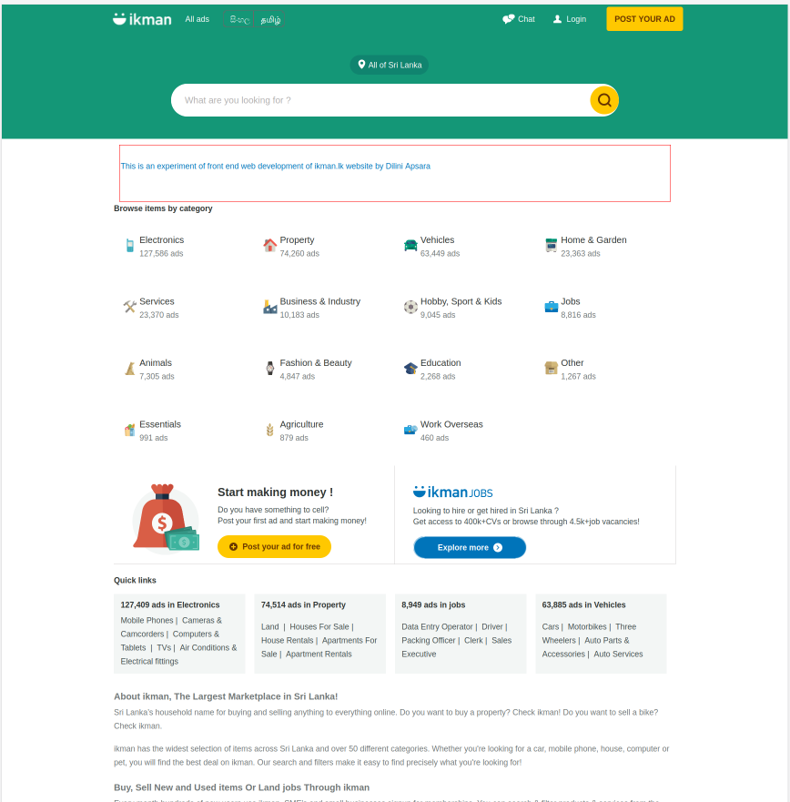
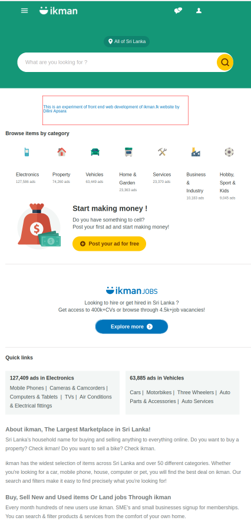

# ikman.lk Clone

This project is a front-end clone of the ikman.lk website. The goal was to replicate the design and layout of the original site using HTML and CSS. The web page is responsive, achieved through the use of media queries.

## Table of Contents

- [Features](#features)
- [Technologies Used](#technologies-used)
- [Visit the Site](#visit-site)
- [Screenshot](#screenshot)
- [License](#license)

## Features

**Responsive Design:**  The site adapts to different screen sizes using media queries.

**HTML and CSS:** Built entirely with HTML5 and CSS3 for a lightweight and fast experience.

**CSS Grid and Flexbox:** Utilizes modern CSS techniques for a structured and flexible layout.

**Visual Consistency:** Replicates the look and feel of the ikman.lk homepage.

## Technologies Used

- HTML5
- CSS3
- Media Queries
- CSS Grid
- Flexbox
- IntelliJ IDEA

## Visit the Site

You can visit to the site using this link.

[visit ikman.lk-clone](https://dilini-apsara.github.io/ikman.lk-clone-experiment/)

## Screenshot
### Desktop Responsive

### Mobile Responsive

## License
Copyright & copy; 2024 DEP 12 All Right Reserved. This project is licensed under MIT.[LICENSE.txt](LICENSE.txt)
